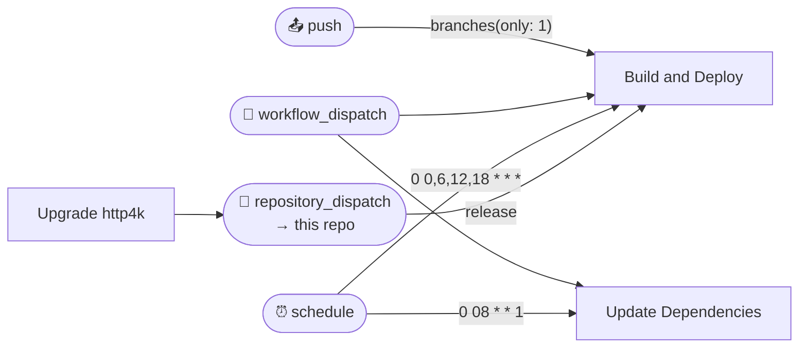

# Workflows

```mermaid
flowchart LR
    push(["📤 push"])
    workflowdispatch(["👤 workflow_dispatch"])
    schedule(["⏰ schedule"])
    repositorydispatchgithubrepository(["🔔 repository_dispatch<br/>→ this repo"])
    buildsiteyml["Build and Deploy"]
    upgradehttp4kyml["Upgrade http4k"]
    updatedependenciesyml["Update Dependencies"]
    push -->|"branches(only: 1)"|buildsiteyml
    workflowdispatch --> buildsiteyml
    workflowdispatch --> updatedependenciesyml
    schedule -->|"0 0,6,12,18 * * *"|buildsiteyml
    schedule -->|"0 08 * * 1"|updatedependenciesyml
    upgradehttp4kyml --> repositorydispatchgithubrepository
    repositorydispatchgithubrepository -->|"release"|buildsiteyml
```

## Workflows

- [Build and Deploy](./build-site/)
- [Update Dependencies](./update-dependencies/)
- [Upgrade http4k](./upgrade_http4k/)