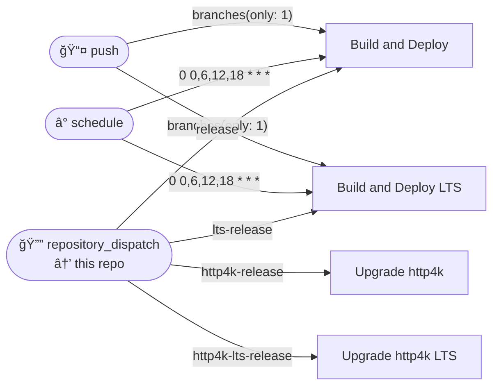

# Workflows

```mermaid
flowchart LR
    push(["📤 push"])
    schedule(["â° schedule"])
    buildyml["Build and Deploy"]
    buildltsyml["Build and Deploy LTS"]
    upgradehttp4kyml["Upgrade http4k"]
    upgradehttp4kltsyml["Upgrade http4k LTS"]
    repositorydispatchgithubrepository(["🔔 repository_dispatch<br/>→ this repo"])
    push -->|"branches(only: 1)"|buildyml
    push -->|"branches(only: 1)"|buildltsyml
    schedule -->|"0 0,6,12,18 * * *"|buildyml
    schedule -->|"0 0,6,12,18 * * *"|buildltsyml
    repositorydispatchgithubrepository -->|"release"|buildyml
    repositorydispatchgithubrepository -->|"lts-release"|buildltsyml
    repositorydispatchgithubrepository -->|"http4k-release"|upgradehttp4kyml
    repositorydispatchgithubrepository -->|"http4k-lts-release"|upgradehttp4kltsyml
```

## Workflows

- [Build and Deploy LTS](./build-lts/)
- [Build and Deploy](./build/)
- [Upgrade http4k LTS](./upgrade_http4k-lts/)
- [Upgrade http4k](./upgrade_http4k/)