# Workflows

```mermaid
flowchart LR
    push(["📤 push"])
    schedule(["⏰ schedule"])
    workflowdispatch(["👤 workflow_dispatch"])
    repositorydispatchgithubrepository(["🔔 repository_dispatch<br/>→ this repo"])
    buildyml["Build and Deploy"]
    buildltsyml["Build and Deploy LTS"]
    upgradehttp4kyml["Upgrade http4k"]
    upgradehttp4kltsyml["Upgrade http4k LTS"]
    updatedependenciesyml["Update Dependencies"]
    push -->|"branches(only: 1)"|buildyml
    push -->|"branches(only: 1)"|buildltsyml
    schedule -->|"0 0,6,12,18 * * *"|buildyml
    schedule -->|"0 0,6,12,18 * * *"|buildltsyml
    schedule -->|"0 08 * * 1"|updatedependenciesyml
    workflowdispatch --> updatedependenciesyml
    upgradehttp4kyml --> repositorydispatchgithubrepository
    repositorydispatchgithubrepository -->|"release"|buildyml
    upgradehttp4kltsyml --> repositorydispatchgithubrepository
    repositorydispatchgithubrepository -->|"lts-release"|buildltsyml
```

## Workflows

- [Build and Deploy LTS](./build-lts/)
- [Build and Deploy](./build/)
- [Update Dependencies](./update-dependencies/)
- [Upgrade http4k LTS](./upgrade_http4k-lts/)
- [Upgrade http4k](./upgrade_http4k/)