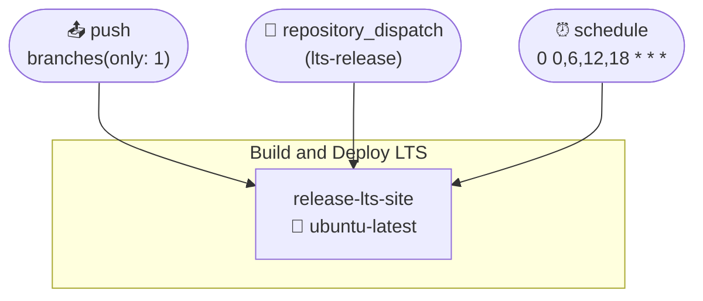
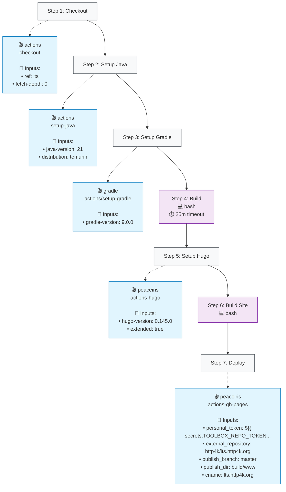

# Build and Deploy LTS (build-lts.yml)

## Job: release-lts-site

| Job | OS | Dependencies | Config |
|-----|----|--------------|---------| 
| `release-lts-site` | 🐧 ubuntu-latest | - | - |

### Steps

**Step Types Legend:**
- 🔘 **Step Nodes** (Gray): Workflow step execution
- 🔵 **Action Blocks** (Blue): External GitHub Actions
- 🔷 **Action Blocks** (Light Blue): Local repository actions
- 🟣 **Script Nodes** (Purple): Run commands/scripts
- **Solid arrows** (→): Step execution flow
- **Dotted arrows** (-.->): Action usage with inputs