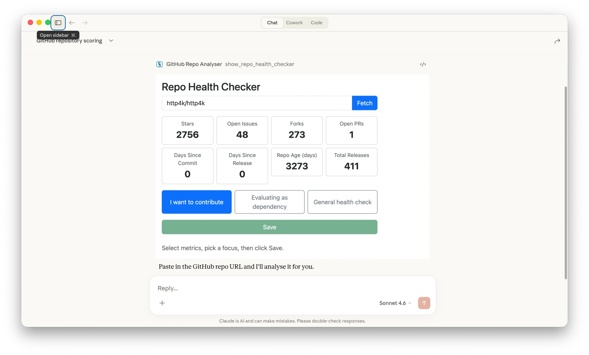

You can turn any MCP Capability - a Tool, a Resource, a Prompt - into a working, spec-compliant MCP server in fewer characters than an old-school tweet. No code generation, no YAML manifests, no runtime magic - just a function that does a thing, served over Streamable HTTP.



That's always been http4k's pitch, and now we've brought the party trick to MCP - any Capability can become a server with the same minimal code.

Yes, it's a contrived example - there's no security, no observability, no structure. But it's also a working MCP server that hands your LLM one of the essential tools it needs to function: knowing what time it is. And with zero dependencies, no reflection, and no classpath scanning, it won't eat your RAM while it's at it - which matters when every AI workload on your cluster is fighting for memory.

But with **v6.35.0.0**, the MCP story has grown well beyond party tricks. There's a *lot* of new goodness, so grab something warm and settle in.

## TL;DR - What's New?

- **Full 2025-11-25 MCP spec** support - including draft features like structured content in tool responses
- **MCP Apps** support (2026-01-26 spec) - server-rendered UI components living inside your AI client
- **http4k-ai-mcp-testing** module with `McpAppsHost` for local testing MCP Apps without Claude or NPX
- **OpenTelemetry MCP Semantic Conventions support** (v1.38.0) - proper observability for your MCP servers
- **OAuth with Resource Metadata** - the auth model the spec should have had from the start
- **x402 Payment-Protected Tools** - monetise individual MCP tool calls with cryptocurrency payments via the x402 protocol
- The **http4k Toolbox** now generates MCP server and MCP App projects - [toolbox.http4k.org](https://toolbox.http4k.org)
- **Passing MCP conformance tests** - we don't consider spec compliance optional

## The Spec, The Whole Spec, and Nothing But The Spec

The 2025-11-25 MCP specification brought a raft of cool new capabilities: Tasks, Elicitations, Sampling upgrades, and expanded Tool support. http4k now supports the lot.

We've also implemented draft spec features - including structured content in tool responses - because we want you to not have to wait for a committee to finish their minutes before they can ship. OAuth auth with resource metadata is now properly supported too, bringing the security model in line with how the rest of the industry does things.

Meanwhile, certain official JVM SDKs are still shipping their wares on... well, let's just say an earlier vintage. But if you're on the JVM and you want the latest spec, as of today there's really only one game in town. You can read the full spec [here](https://modelcontextprotocol.io/specification/2025-11-05).

## MCP Apps - UIs Inside Your AI

If you ask us (and literally nobody does!) [MCP Apps](https://modelcontextprotocol.io/specification/2026-01-26) are the most exciting addition to the MCP ecosystem in a while. They let your MCP server render rich UI components - HTML, CSS, the works - directly inside AI clients like Claude Code. Think interactive dashboards, form-based workflows, or data visualisations, all served from your server and displayed right where the user is chatting.

This is a genuine innovation for building rich agent experiences. No more describing a table in markdown and hoping the LLM formats it correctly - you can just get your MCP server to render it as intended without the user leaving the chat.

An MCP App combines Tools and Resources under the hood, but http4k wraps the wiring into a single `RenderMcpApp` Capability - so building one is just as concise as any other server:



We've written a full tutorial to get you started: **[Build a Simple MCP App](https://www.http4k.org/tutorial/build_a_simple_mcp_app/)**. Want to see one running? Just add [this](https://demo.http4k.org/mcp-sdk/mcp) custom connector to Claude. And if you'd rather skip the reading and get straight to code, [Toolbox](https://toolbox.http4k.org) can generate a complete MCP Server or App project for you in about a minute - or even longer if you actually want to read the full list of http4k modules.

## Test MCP Like You Mean It

And of course, once you've got a working MCP Server or App, you need to test it. We've extracted out all MCP testing utils into the new handy **`http4k-ai-mcp-testing`** module. You shouldn't have to test your MCPs by pointing Claude at it and squinting at the output - that's simply not good enough.

For standard MCP servers, `testMcpClient()` creates a fully in-memory test client. No network, no ports, no flaky CI. Just your server, your tests, and the truth:



This is the http4k way: if you can't test it in a unit test, it doesn't ship.

And as a bonus for the keen amongst you, `McpAppsHost` gives you a pure Kotlin host for testing MCP Apps locally - no Claude, no NPX, no "works on my machine" hand-waving. Point it at your MCP App servers (in-memory or remote) and it provides a lightweight web UI for interacting with them directly:



## See Everything with OpenTelemetry

MCP servers that you can't observe are MCP servers you can't trust. We've added support for the [OpenTelemetry MCP Semantic Conventions](https://opentelemetry.io/docs/specs/semconv/gen-ai/mcp/), giving you proper server-side OTel convention spans just by plugging in a standardised `McpFilter` which will capture OTel traces across your MCP interactions, so your existing observability stack - Jaeger, Honeycomb, Datadog, whatever you fancy - just works. No custom instrumentation required.

## Monetise Your Tools with x402

So you've built a beautifully tested, fully observable MCP server. Now - and we realise this is a radical concept - what if you could actually get *paid* for it?

The **`http4k-ai-mcp-x402`** module integrates the [x402 protocol](/ecosystem/connect/reference/x402/) with MCP, letting you require cryptocurrency payments for individual tool calls. Wrap any tool with `X402ToolFilter` and it'll demand payment before executing - no invoicing platform, no subscription management, no "please enter your credit card" forms. Just cryptographic proof that someone paid you, verified and settled before the tool runs.

The best part? You can mix free and paid tools in the same server. Give away the appetisers, charge for the main course. Payment payloads flow through MCP's `_meta` fields, so everything stays within the protocol - no side channels, no out-of-band handshakes.

Here's what mixing free and paid tools looks like in practice:



It's early days for the x402 ecosystem, but we think tool-level monetisation is going to matter a lot as MCP matures. And when it does, you'll already be ready.

## Ship It

We believe that http4k's MCP SDK is the most complete, most testable, and most spec-current MCP implementation on the JVM. And that's not marketing - it's just what happens when you spend every week shipping spec updates while maintaining the engineering standards your users expect. And our first users are us!

Our MCP libraries are included in the http4k [Pro tier](https://http4k.org/pro/) and all [Enterprise Edition subscriptions](https://www.http4k.org/enterprise/), with free use for personal projects, non-profit organisations, non-commercial research, and qualifying small businesses (see our [commercial license](/commercial-license/) for exact terms).

Questions? Feedback? War stories? Find us on GitHub or the [Kotlin Slack](https://kotlinlang.slack.com). We'd love to hear what you're building.

And if you want to hear about the functional design behind the MCP SDK, we'll be talking about it at [KotlinConf 2026](https://kotlinconf.com) in Munich - see you there!

Happy coding!

# /the http4k team
