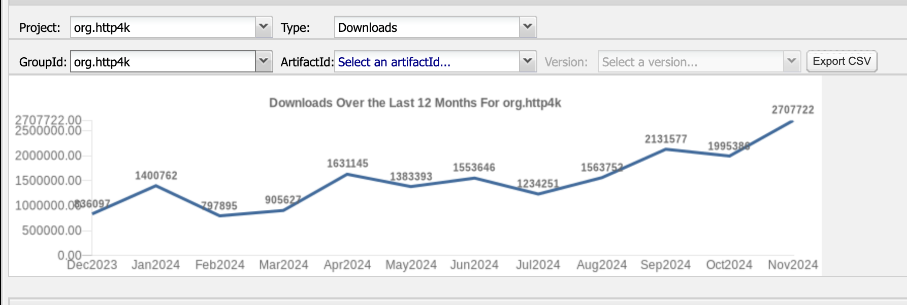

As previewed in our previous post, http4k 6 is finally here! We’ve been incredibly busy planning this release for about
6 months and have been exploring the best ways to expand the http4k universe to make things even better.

This is going to ge a fairly long post, so here's what's coming up:

<insert toc/>

If you just want to skip straight to the part where you upgrade your codebase, then check out
the [v5 to v5 Migration Guide](/howto/migrate_from_http4k_v5_to_v6) - it's got an overview of how to get started. If
we've done our job correctly, it shouldn't be too bad!

# A review of http4k v5

Released at KotlinConf 2023, http4k has steadily been growing in both size and audience. The number of modules has risen
from 127 to a massive 188 in that time. Everything from AI integrations (OpenAI, Anthropic, LangChain), to Hypermedia
libraries ( HTMX), to transport formats (DataFrame), to templating engines (JTE) and cloud platform clients (Azure,
GCP) - we've pretty much added modules for anything an everything!

And with it, you can see from the below that http4k’s downloads have been on a very pleasingly upward trend. It's
encouraged the http4k team to keep going and we decided that v6 was a good time to have a really long hard look at how
the project was structured and what we could do better.

#### The first CVE: CVE-2024-12345

It might seem strange to celebrate your first CVE, but it’s a rite of passage for any popular open-source project and an
excellent opportunity to learn. We were very pleased to have been able to fix the issue quickly and to have been able to
provide a fix to all users within a few hours of the issue being reported by a security researcher. This is a testament
to the efforts the team have made with http4k to ensure we provide a secure and reactive system, and the power of the
open-source model in general.

You can read about the CVE, the fix and the timeline [here](/security/CVE-2024-55875)

We were also particularly impressed with the score of the CVE - **9.8**. Higher numbers are better, right?

# What’s new in http4k v6?

There's a lot to cover, so let's dive in!

#### Minimum supported Java version

Ever since the inception of http4k, we've made sure to support the widest array of Java versions possible - meaning that
every one of the over 700 http4k releases supported every Java version down to v8 (released in 2014). However, we always
knew that this decision could not last indefinitely and we are taking this opportunity to move forward into the future
in a more strategic way, so we are bumping the minimum JDK version to Java 21 (which also went out of free support in
October 2024). As well as learning from our mistakes and making some changes to the core of the library, this will allow
us to take advantage of newer JVM features such as Virtual Threads, and optimisations in the target class file format.
This decision should provide a performance boost for all users, and allowed us to update all of those old dependencies
which were holding us back from adopting them.

But we aren't abandoning our commitment to stability and long-term support. For organisations that need extended support
for older Java versions, we're announcing http4k Enterprise Edition. This offering includes Long Term Support (LTS) for
previous Java versions, ensuring that teams running mission-critical applications on established Java platforms can
continue to benefit from a stable API and security updates. Enterprise Edition subscribers receive access to dedicated
support channels, priority bug fixes, and the ability to influence the roadmap of the framework, as well as
complimentary access to the http4k Pro modules (more of that later!).

While the open source Community Edition moves forward to embrace new Java features, Enterprise subscribers will continue
to receive support for legacy versions through LTS releases. This approach allows us to serve both forward-looking
projects and organizations requiring longer-term stability. Whether you're building new services on Java 21 or
maintaining critical systems on older versions, we've got you covered!

#### Module/Code reorganisation

As http4k has grown to now over 180 modules, we've found that the existing module naming system has become a little
unwieldy, so we took the opportunity to reorganise our thinking and the existing modules around the core conceptual
arenas. You can find the old

As such, we've reorganised some of the existing modules and these will need to be migrated as part of the upgrade to v6.
You can find the list of movements in the [migration guide](/howto/migrate_from_http4k_v5_to_v6).

#### Knives for show, guns for a pro!

Also new to http4k - Pro modules! These extensions represent our implementations of common enterprise tools and
patterns, built with the same unwavering commitment to testability and clean API design that has earned http4k its
reputation. We've currently got plans for three powerful modules: Hot Reload, which enables seamless code updates in
running applications; a Model Context Protocol SDK, providing a complete implementation of the MCP standard for AI
system interoperability and agent communication; and Transaction Outbox, implementing the critical outbox pattern for
reliable message publishing in distributed systems.

Each Pro module delivers battle-tested solutions to common challenges while maintaining http4k's trademark developer
experience - simple, compositional APIs with rock-solid testing support. These implementations embody years of the
http4k team's real-world experience solving complex problems in production systems, packaged into modules that work
seamlessly with the rest of http4k.

#### Universal protocol routing

Whilst http4k has supported WebSockets and Server-Sent Events for a while, we found it quite annoying that the routing
logic was different for each protocol. This has now been unified across all protocols, which has necessitated a complete
rewrite of the routing code, but now the API should remain the largely same for users. Any breaks should be easily
fixable using the IDE. Additionally, for applications that serve multiple protocols, the above changes have allowed a
new DSL builder for `Polyhandlers`, which allows you mix and match the protocols you want to support in a single
application. Here's an example:



Note that you still need the correct server backend to take advantage of all protocols. There's
a [handy grid](ecosystem/http4k/reference/servers/#feature-support) in the docs.

#### Multi protocol support

Speaking of WebSockets and SSE, http4k was lacking the same type of experience around these protocols as it had for
HTTP. As well as the routing rewrite to unlock the power of the previously only HTTP model, we've added debugging
support for all protocols and consistentified the interface so all protocols are now equally loved.



#### The future of web development

Although mostly known for being backend engineers, the http4k team have always been interested in the full stack.
Frontend development however, has gotten a bit out of hand with the complexity of the frameworks and the amount of
JavaScript that needs to be written, so we were very interested in the rise of hypermedia frameworks such
as [HTMX](https://htmx.org/) and [Datastar](https://data-star.dev) as a way to simplify the frontend and to provide an
accessible, lightweight experience. As such, we've added support for these frameworks in http4k and homed them in a new
namespace `http4k-web`. These frameworks are well worth a look in the way they keep a lot of server state on the backend
and thus open up opportunities to unify logic whilst still providing a reactive experience. Of special mention are the
possibilities opened up by Datastar's seamless SSE/HTTP interop and the ability to control the flow of reactive data
from the serverside. Expect more of this in the future!

#### Developer tooling

http4k has always been a developer-first framework and we are always looking for ways to make the developer experience
better. The new `http4k-tools` namespace is the new home for all developer tooling modules, and we've promoted
`http4k-tools-traffic-capture` as the first module in this space - it allows you to capture and replay HTTP traffic
to/from a folder structure or any other source you can think of!

#### Holy Hot Reload Batman!

The http4k Template namespace has supported HotReload for a while, but this only supported the templating layer. We've
made this better and you can now hot reload your entire application, including the routing layer. This is a game changer
for using http4k with libraries like KotlinX HTML or HTMX/Datastar, where you can now see your changes in real time.
Check it out at `http4k-tools-hotreload`.

#### Bridging the divide to http4k

It's easy enough to start from scratch with http4k, but we know that many of you have existing codebases that you want
to migrate to http4k. Having done this ourselves, we know that it can be a bit of a pain to get started, which is why to
make this easier, we've added a new `http4k-bridge` namespace which provides a set of modules to help you bridge the gap
between http4k and other JVM technologies. This will be accompanied by a set of how-to guides which will cover the
basics and strategies for migration. Here's a list of the initial technologies in the Bridge namespace:

- Helidon
- Jakarta (handles Quarkus any any other Jakarta EE server)
- Ktor
- Micronaut
- Ratpack
- Spring Web
- Servlet (Tomcat or any other servlet container)
- Vertx

#### Full protocol support using Virtual Threads

We were very excited to see the release of Helidon 4.0 with support for virtual threads as a http4k v5 module, and we
have expanded it to support SSE and WS as well. This is a game changer for the performance of reactive applications.

#### Simplified ServerConfig

With a choice of 12 or so servers, the ServerConfig was getting a bit unwieldy with various options and a non-uniform
approach. We have now removed all of the options that were not strictly necessary and have provided a simple example of
each server. This should make it easier to get started with http4k and to understand the options available. The old
versions of the code have been moved to examples in the http4k source code, so if you need explicit support for these
options in Undertow Apache etc then you can still access them.

## Notable breaking changes

**http4k-core** : [Breaking] Complete rewrite of the routing logic to work identically across HTTP, WS and
SSE. [FIXME] <-- Insert breaking changes

- **http4k-api-openapi** : [Breaking] withPostSecurityFilter() removed as is part of the contract DSL.
- sse change packages
- sse now logs transactions
- sse debugging
- ws change packages
- ws now logs transactions
- ws debugging
- Java SSE client
- KMS CustomerKeySpec removed -> replaced with KeySpec
- HttpEvent is now a subclass of ProtocolEvent
- routing changes mean things are no longer data classes
- All extraneous server configuration removed - we now support only simple examples of servers and people need to
- Rewrite routing algorithm - unify all protocol routing

- As per the pre-release announcement, the minimum Java version for http4k has been raised to Java 21. If your
  organisation is interested in maintaining support for Java versions lower than 21, you may be interested to learn
  about the Long Term Support options available under the http4k Enterprise Edition subscription. You can read more
  about this programme [here], and feel free to reach out to the  <a href="enterprise@http4k.org">http4k team</a>.
- The http4k routing system had been completely rewritten and unified across all supported protocols (HTTP/SSE/WS). This
  has resulted in some small repackaging although the API should not have changed for users. Any breaks should be easily
  fixable using the IDE.
- For ease, `ServerConfigs` across all server-backends have been simplified, removing any extraneous setup from the
  default configuration. The standard implementations have been designed to be duplicated and tweaked as required by end
  users.
- As http4k has grown to over 160 modules, we've found that the existing module naming system has become a little
  unwieldy. To make things easier to find, we've reorganised some of them and given them better Maven co-ordinates (
  documented below).
- We have unified some events - notably `HttpEvent` - to be the same implementation across all protocols, which has
  necessitated the replacement of `HttpEvent` with `ProtocolEvent`. The API is the same as before as are the names, but
  the hierarchy is different, and the event has gained a `protocol` field to indicate what type of server request
  caused the connection.

## Suggested migration path

1. Update your project to use the latest version of http4k v5.
2. Deal with any deprecation warnings - these should all have replacements and be inlinable using your IDE.
3. Start using the new module names from the table below. These modules are identical in functionality to the old ones,
   but have been renamed for consistency.
4. Build and check your project is still working as expected.
5. Update your project to use the latest version of http4k v6.
6. Deal with any breaking changes - these are detailed below.

### Notes:

- Move security to security core - share between SSE and HTTP
- Debug to all protocols
- Unify routing across all protocols
- Bridge modules
- Upgrades to all modules
- Upgrade to java 21
- Polyhandler DSL
- moving code out of core, bridge
- traffic module
- module moves
- datastar module
- simplify request context
- pro stuff
    - MCP Desktop - no reflection
    - MCP SDK - no reflection
    - Hot reload - debuggable
- [Breaking[ moshi - have added long

### v6.0.0.0 (uncut)

- **http4k-*** : [License update] Selected "Pro-tier" modules will start to be introduced under the new
  http4k [commercial license](https://github.com/http4k/http4k/blob/master/pro/LICENSE). These modules remain freely
  available for personal and academic purposes, and bear the new `org.http4k.pro` Maven coordinate group to distinguish
  them from the open-source modules.
- **http4k-*** : [Breaking] Minimum Java version is now 21. Java versions 8-20 support is provided through our LTS
  programme available through the commercial version of http4k. Please see: https://www.http4k.org/enterprise/
- **http4k-*** : [Breaking] Repackaging/splitting code into new modules coordinates. See the mapping grid below:

- **http4k-*** : [Breaking] Complete rewrite of the routing logic to work identically across HTTP, WS and SSE. Mostly
  backwards compatible, but some small may be required if you are referencing low level routing classes.
- **http4k-*** : [Breaking] Removal of all deprecations. See the migration guide for more details.
- **http4k-core** : [Breaking] `regex` lens now returns the entire matched string. To match groups, use `regexGroup`
  instead.
- **http4k-contract** : [Breaking] `withPostSecurityFilter()` removed as is part of the contract DSL.
- **http4k-realtime-core** : [Breaking] From above, repackaging of SSE and Websocket routing and filters.
- **http4k-connect-amazon-kms** : [Breaking] `CustomerKeySpec` removed and replaced with `KeySpec` (as per AWS
  deprecations)
- **http4k-server** : [Breaking] For consistency, all server configurations have been simplified to only support only
  simple examples. Anything more convoluted should be handled by user implementations.
- **http4k-api-contract** : [Breaking] Security implementations moved from contract to security-core. This has involved
  repackaging them, but the APIs remain the same.
- **http4k-api-jsonrpc** : [Breaking] Repackaging of some classes - APIs remain the same.
- **http4k-cloudnative** : [Breaking] Code has moved to a combination of `http4k-config`, `http4k-platform-core` and
  `http4k-platform-k8s` modules.
- **http4k-*** : [Unlikely Break] Upgrades all dependencies to latest versions. This may involve API changes if you are
  reliant on APIs in previous versions.
- **http4k-format-moshi** : [Unlikely break/Enhancement] Support for `MoshiLong` as well as `MoshiInteger`. This has
  improved the handling of longs when using the `MoshiNode` types.
- **http4k-serverless-*** : [Unlikely break] Replacement of serverless `Context` system to use new `RequestKey`
  mechanism.
- **http4k-core** : [Replacement/Upgrade] `RequestContextKey` mechanism replaced with new simpler `RequestKey` lenses.
  This obliviates the need for the old `InitializeRequestContext` mechanism and filter
- **http4k-server-helidon** : [Fix] SSE implementation now cleans up SSE connections correctly on close.
- **http4k-*** : [Enhancement] Unified the Events for HTTP, WS and SSE to use the same `ProtocolEvent` type for tracing
  and logging transactions.
- **http4k-realtime-core** : [Enhancement] Added ability to use debugging filters for both SSE and WebSockets.
- **http4k-realtime-core** : [Enhancement] New DSL for defining Polyhandlers for routing to different types of
  HTTP/SSE/Websocket protocols connections. Use `poly()`.
- **http4k-realtime-core** : [Enhancement] SSE client for connecting to Server-sent events. Includes configurable
  auto-reconnection modes.
- **http4k-format-moshi** : [Enhancement] Support for Data4k containers for Moshi.
- **http4k-tools-hotreload** : [New Pro module!] Work with any http4k-based application without restarting the server.
  Includes browser reloading when working with web-based code, assets and templates. Extensible with custom rebuild
  logic - ships with Gradle support.
- **http4k-bridge-jakarta** : [New module!] Easy migrations from/to Jakarta-based servers.
- **http4k-bridge-spring** : [New module!] Easy migrations from/to Spring-based servers.
- **http4k-bridge-vertx** : [New module!] Easy migrations from/to Vertx-based servers.
- **http4k-bridge-ktor** : [New module!] Easy migrations from/to Ktor-based servers.
- **http4k-bridge-micronaut** : [New module!] Easy migrations from/to Micronaut-based servers.
- **http4k-bridge-ratpack** : [New module!] Easy migrations from/to Ratpack-based servers.
- **http4k-web-datastar** : [New module!] Deep support for the super-powerful [Datastar](https://data-star.dev)
  Hypermedia library, which helps you build reactive web applications with the simplicity of server-side rendering and
  the power of a full-stack SPA framework..
- **http4k-tools-traffic-capture** : [New module!] A set of tools to help the capture and replay of traffic from any
  HTTP server.
