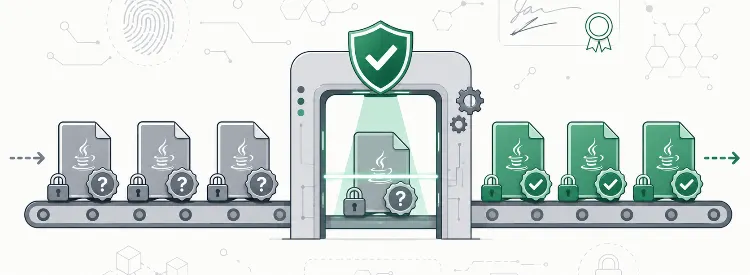

Back in **[Tale of the tape](/news/tale-of-the-tape-claude-vs-http4k/)** we spent four rounds hardening the http4k source and then flagged the other half of the problem: hardening the code proves the code is sound, but it says nothing about the bytes that actually land in your build. *Proving the JAR you pulled off the repo is the exact one we signed and shipped* is a different job - and it's the one **http4k Verify** does. It's the newest capability in **[http4k Enterprise Edition](/enterprise/)**, and it's generally available to subscribers today.

**TL;DR:** http4k Verify is a single Gradle plugin, included with http4k Enterprise Edition. Apply it, and every http4k dependency in your build is checked - JAR signatures, CycloneDX SBOMs, SLSA provenance and licence reports - **before your code compiles**. Tampered artifact? The build fails. Clean build? You get a signed attestation report to hand your auditors. One line, zero config, results cached so there's no day-to-day overhead.

---

## Why this exists

Nobody ships an app any more - they ship a dependency tree, and every node in it is someone else's code arriving over the wire. The interesting attacks stopped being "find a bug in the app" a while ago; they're "get something into the supply chain and let the build tools carry it the rest of the way".

The regulators have noticed too, and the deadlines are close. The **EU Cyber Resilience Act** is mandatory from **September 2026** and wants verifiable provenance and machine-readable SBOMs for everything sold into Europe. **US Executive Order 14028**, **NIST SSDF** and **PCI DSS 4.0** all push the same way: know what's in your software, and prove the third-party pieces are what they claim to be.

You can meet that at audit time by scrambling for evidence after the fact, or you can capture it at build time and move on. Verify is firmly in the second camp.

## What http4k already ships

Every http4k Enterprise Edition artifact - all 200+ modules, both community (`org.http4k`) and pro (`org.http4k.pro`) - is published with the evidence baked in:

- a **cosign signature** for the JAR, with a trusted timestamp from the Sigstore Timestamp Authority
- a **CycloneDX SBOM** listing every transitive dependency
- **SLSA Build Level 2 provenance** linking the artifact to the exact commit and CI pipeline that built it
- a signed **licence compliance report**

Signing runs in a job isolated from the build - the job that compiles the code holds no signing keys. It's a genuinely hardened Level 2 posture; we're deliberately precise about that rather than rounding up. (Full detail, including where SLSA Level 3 fits, is on the **[Supply Chain Security](/supply-chain-security/)** page.)

That's not bolted-on marketing - it's how the whole project is run. We walked through the wider picture, from vulnerability reporting to signed releases, in **[Publishing our homework](/news/publishing-our-homework/)**. Verify is the next link in that chain: it extends the same assurance from *how http4k is built* to *what lands in your build*.

## The SLSA bit, briefly

Each artifact carries a signed [SLSA provenance](https://slsa.dev/provenance/v1) attestation - an [in-toto](https://in-toto.io/Statement/v1) statement tying it to the exact **git commit**, the **workflow** that built it, and the **SHA-256 digests** of everything produced.

Because these artifacts are distributed privately rather than to the public world, verification is key-based and works **fully offline** - against a signing key you already trust, with no round-trip to a public transparency log.

## One plugin. One line.

Here's the whole integration:

```kotlin
plugins {
    id("org.http4k.verify") version "6.56.0.0"
}
```

That's it. On the next build the plugin downloads the http4k [signing key list](https://http4k.org/.well-known/cosign-keys.json), resolves the sigstore bundles for every http4k dependency, and verifies each signature **with the correct key for that artifact** - so key rotation just works, because each artifact's provenance carries the fingerprint of the key that signed it. Results are cached, so subsequent builds have zero overhead until your dependencies change.

You can run it explicitly too:

```shell
./gradlew verifyHttp4kDependencies
```

```
Verifying 3 http4k module(s)...
  org.http4k:http4k-core:6.56.0.0              jar ✓   sbom ✓   provenance ✓   license ✓
  org.http4k:http4k-format-jackson:6.56.0.0    jar ✓   sbom ✓   provenance ✓   license ✓
  org.http4k:http4k-server-undertow:6.56.0.0   jar ✓   sbom ✓   provenance ✓   license ✓
Verified: 3 modules, 12 signatures
```

If a signature doesn't match, the check is marked **✗** and the build stops. No silent pass, no runtime surprise.

Every run also exports everything it touched to `build/http4k-verify/` - the SBOMs, provenance, licence reports and sigstore bundles - alongside a `verification-report.json`. That report is the point: a timestamped, per-module record of exactly which artifacts, with which hashes, were verified against which signatures. Drop it straight into your audit trail or CI artifacts as evidence.

No CLI tools to install, and nothing exotic in your infrastructure - it works through **Artifactory**, **Nexus**, or any repository manager proxying **[maven.http4k.org](https://maven.http4k.org)**.

## What you should do

If you're an **[http4k Enterprise Edition](/enterprise/)** subscriber, add the plugin to your build today and get supply-chain assurance for every http4k dependency with essentially zero effort. The full setup - configuration, manual cosign verification, and Gradle dependency pinning - is in the **[Verify reference docs](/ecosystem/enterprise/reference/verify/)**.

Not on EE yet and this is the kind of evidence your security team is going to be asking for? **[Get in touch](/enterprise/)** or email enterprise@http4k.org - and take a look at **[verify.http4k.org](https://verify.http4k.org)**.

Trust every dependency. Verify every build.

Peace out.

## // the http4k team
